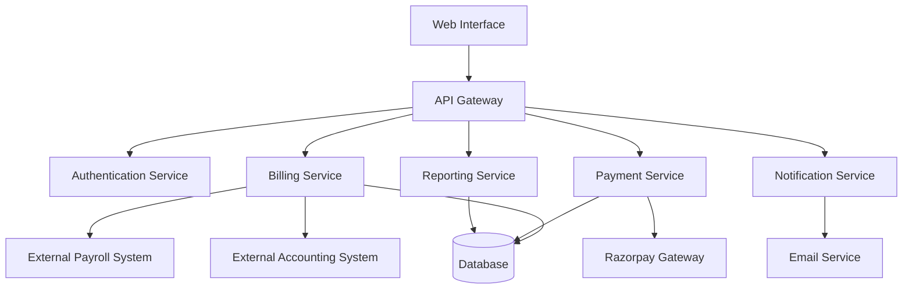

# Billing Platform Design Document

## Overview

The Billing Platform is a comprehensive financial management system designed for Holy Family Polymers that handles both staff salary processing and customer billing operations. The system integrates with existing payroll and accounting modules while providing automated billing cycles, payment processing through Razorpay, and detailed financial reporting capabilities.

The platform follows a microservices architecture with clear separation between billing logic, payment processing, reporting, and user interfaces. It ensures data consistency across integrated systems while maintaining audit trails for compliance requirements.

## Architecture

### High-Level Architecture



### Service Architecture

The system is organized into the following core services:

1. **API Gateway**: Central entry point handling routing, authentication, and rate limiting
2. **Billing Service**: Core business logic for invoice generation, salary calculations, and billing cycles
3. **Payment Service**: Handles payment processing, gateway integration, and transaction management
4. **Reporting Service**: Generates financial reports, analytics, and audit trails
5. **Notification Service**: Manages email notifications, alerts, and communication
6. **Authentication Service**: User management, role-based access control, and session handling

## Components and Interfaces

### Core Components

#### Billing Engine
- **SalaryCalculator**: Processes staff salary calculations with deductions and allowances
- **InvoiceGenerator**: Creates customer invoices with tax calculations and formatting
- **BillingCycleManager**: Manages automated billing schedules and recurring processes
- **TemplateEngine**: Handles customizable billing templates for different service types

#### Payment Processor
- **PaymentGatewayAdapter**: Interfaces with Razorpay for payment processing
- **TransactionManager**: Handles payment state management and reconciliation
- **PaymentValidator**: Validates payment data and ensures transaction integrity

#### Data Access Layer
- **BillingRepository**: Manages billing data persistence and retrieval
- **PaymentRepository**: Handles payment transaction storage and queries
- **ReportRepository**: Provides data access for reporting and analytics
- **AuditRepository**: Maintains audit trails and compliance logs

### External Interfaces

#### Payroll System Integration
```typescript
interface PayrollIntegration {
  syncStaffData(): Promise<StaffMember[]>;
  updateSalaryRates(staffId: string, rates: SalaryRates): Promise<void>;
  getPayrollHistory(staffId: string, period: DateRange): Promise<PayrollRecord[]>;
}
```

#### Accounting System Integration
```typescript
interface AccountingIntegration {
  postTransaction(transaction: Transaction): Promise<string>;
  reconcilePayments(period: DateRange): Promise<ReconciliationReport>;
  updateChartOfAccounts(account: AccountEntry): Promise<void>;
}
```

#### Payment Gateway Interface
```typescript
interface PaymentGateway {
  processPayment(paymentRequest: PaymentRequest): Promise<PaymentResponse>;
  verifyPayment(transactionId: string): Promise<PaymentStatus>;
  refundPayment(transactionId: string, amount: number): Promise<RefundResponse>;
}
```

## Data Models

### Core Entities

#### Staff Member
```typescript
interface StaffMember {
  id: string;
  employeeId: string;
  name: string;
  email: string;
  department: string;
  position: string;
  salaryStructure: SalaryStructure;
  bankDetails: BankDetails;
  isActive: boolean;
  createdAt: Date;
  updatedAt: Date;
}

interface SalaryStructure {
  basicSalary: number;
  allowances: Allowance[];
  deductions: Deduction[];
  taxSettings: TaxSettings;
}
```

#### Invoice
```typescript
interface Invoice {
  id: string;
  invoiceNumber: string;
  customerId: string;
  customerDetails: CustomerDetails;
  items: InvoiceItem[];
  subtotal: number;
  taxAmount: number;
  totalAmount: number;
  status: InvoiceStatus;
  dueDate: Date;
  createdAt: Date;
  paidAt?: Date;
}

interface InvoiceItem {
  description: string;
  quantity: number;
  unitPrice: number;
  taxRate: number;
  amount: number;
}
```

#### Payment Transaction
```typescript
interface PaymentTransaction {
  id: string;
  transactionId: string;
  invoiceId?: string;
  payrollId?: string;
  amount: number;
  currency: string;
  paymentMethod: PaymentMethod;
  gatewayResponse: GatewayResponse;
  status: TransactionStatus;
  processedAt: Date;
  reconciled: boolean;
}
```

#### Billing Template
```typescript
interface BillingTemplate {
  id: string;
  name: string;
  type: TemplateType;
  fields: TemplateField[];
  calculationRules: CalculationRule[];
  formatting: TemplateFormatting;
  isActive: boolean;
  createdBy: string;
  createdAt: Date;
}
```

### Database Schema

The system uses MongoDB for flexible document storage with the following collections:
- `staff_members`: Staff information and salary structures
- `invoices`: Customer billing records
- `payments`: Payment transactions and gateway responses
- `billing_templates`: Customizable billing templates
- `audit_logs`: System audit trails and compliance records
- `reports`: Generated report metadata and cached results

## User Interface Design

### Landing Page Design

The landing page serves as the primary entry point for the Holy Family Polymers billing platform, featuring modern design principles with the company branding.

#### Visual Design Elements

**Color Scheme**:
- Primary: Modern gradient from light blue (#4A90E2) to teal (#2ECC71)
- Secondary: Clean white (#FFFFFF) with subtle gray accents (#F8F9FA)
- Accent: Professional navy (#2C3E50) for text and borders
- Success: Green (#27AE60) for positive actions
- Warning: Orange (#F39C12) for alerts

**Typography**:
- Headings: Inter or Roboto (bold, clean sans-serif)
- Body text: Open Sans or system fonts for readability
- Monospace: Source Code Pro for technical data

**Layout Structure**:
```
Header Navigation
├── Holy Family Polymers Logo (left)
├── Navigation Menu (center): Home | About | Services | Contact
└── Login Button (right)

Hero Section
├── Company Logo (prominent display)
├── Main Headline: "Smart Accounting for Rubber Manufacturing"
├── Subtitle: Professional billing and payroll management
├── Call-to-Action Buttons: "Get Started" | "Contact Sales"
└── Hero Image/Illustration

Features Section
├── Service Cards (3-column grid)
├── Automated Billing
├── Payroll Management
└── Financial Reporting

Footer
├── Company Information
├── Quick Links
└── Contact Details
```

#### Component Specifications

**Header Component**:
- Fixed navigation with transparent background that becomes solid on scroll
- Holy Family Polymers logo positioned prominently on the left
- Responsive hamburger menu for mobile devices
- Login button with hover effects

**Hero Section**:
- Full-width gradient background (light blue to teal)
- Centered content with maximum width of 1200px
- Company logo displayed at 120px height
- Animated text elements with fade-in effects
- Responsive design scaling for mobile devices

**Feature Cards**:
- Clean white cards with subtle shadows
- Icon-based design with consistent spacing
- Hover effects with slight elevation
- Mobile-responsive grid layout

#### Responsive Design

**Desktop (1200px+)**:
- Full navigation menu visible
- Three-column feature layout
- Large hero section with prominent logo

**Tablet (768px - 1199px)**:
- Condensed navigation
- Two-column feature layout
- Adjusted hero section proportions

**Mobile (< 768px)**:
- Hamburger menu navigation
- Single-column feature layout
- Stacked hero content with smaller logo

### Dashboard Interface

**Staff Dashboard**:
- Clean sidebar navigation with role-based menu items
- Main content area with card-based layout
- Consistent use of company colors and branding
- Data tables with sorting and filtering capabilities

**Admin Dashboard**:
- Advanced navigation with collapsible sections
- Multi-panel layout for complex operations
- Chart and graph integration for reporting
- Bulk action capabilities with confirmation dialogs

### Form Design Standards

**Input Fields**:
- Consistent padding and border radius (8px)
- Focus states with company primary color
- Validation messages with appropriate color coding
- Placeholder text in subtle gray

**Buttons**:
- Primary: Company teal with white text
- Secondary: White with teal border
- Danger: Red for destructive actions
- Consistent hover and active states

### Accessibility Considerations

- WCAG 2.1 AA compliance
- Keyboard navigation support
- Screen reader compatibility
- High contrast mode support
- Focus indicators for all interactive elements

## Correctness Properties

*A property is a characteristic or behavior that should hold true across all valid executions of a system-essentially, a formal statement about what the system should do. Properties serve as the bridge between human-readable specifications and machine-verifiable correctness guarantees.*

### Property Reflection

After analyzing all acceptance criteria, several properties can be consolidated to eliminate redundancy:

- Salary calculation properties (1.2, 1.5) can be combined into comprehensive salary processing validation
- Invoice generation properties (2.2, 2.3) can be unified into complete invoice creation validation  
- Status tracking properties (2.5, 4.4) can be merged into comprehensive state management validation
- Integration properties (7.1, 7.2, 7.3) can be consolidated into unified system synchronization validation
- Audit and compliance properties (5.5, 7.5, 8.3) can be combined into comprehensive audit trail validation

### Core Properties

**Property 1: Automated billing generation completeness**
*For any* billing cycle and set of active staff members, when the billing cycle begins, salary bills should be generated for exactly all active staff members with no duplicates or omissions
**Validates: Requirements 1.1**

**Property 2: Salary calculation accuracy**
*For any* staff member with valid salary structure, when generating salary bills, the calculated gross salary, deductions, and net salary should follow the defined calculation rules and validation constraints
**Validates: Requirements 1.2, 1.5**

**Property 3: Payslip data completeness**
*For any* generated salary calculation, the resulting payslip should contain all required itemized breakdown fields and be stored with a unique reference number
**Validates: Requirements 1.3, 1.4**

**Property 4: Invoice creation consistency**
*For any* valid service selection and customer data, when creating invoices, the system should generate unique invoice numbers following company format and calculate taxes and totals correctly
**Validates: Requirements 2.1, 2.2, 2.3**

**Property 5: Invoice lifecycle management**
*For any* invoice, the system should track status transitions from creation through payment completion and send appropriate notifications at each stage
**Validates: Requirements 2.4, 2.5, 4.4**

**Property 6: Staff dashboard data accuracy**
*For any* staff member accessing their dashboard, the displayed salary breakdown should match their current month's calculated salary data with all allowances and deductions visible
**Validates: Requirements 3.1, 3.2**

**Property 7: Historical data accessibility**
*For any* staff member or user requesting historical data, the system should provide accurate downloadable records for the requested time periods
**Validates: Requirements 3.3, 4.5**

**Property 8: Query and dispute handling**
*For any* staff member raising salary queries, the system should capture all required dispute information and enable proper tracking and resolution
**Validates: Requirements 3.4**

**Property 9: Notification delivery consistency**
*For any* system event requiring notifications (payslip availability, payment confirmations), the system should send notifications to the correct recipients with accurate information
**Validates: Requirements 3.5, 4.1**

**Property 10: Payment processing integrity**
*For any* user payment attempt, the system should process payments securely through the payment gateway, update invoice status correctly, and generate confirmation receipts
**Validates: Requirements 4.2, 4.3**

**Property 11: Template and schedule management**
*For any* billing template or payment schedule configuration, the system should validate all required fields, support multiple schedule types, and maintain proper audit trails for modifications
**Validates: Requirements 5.1, 5.2, 5.3, 5.5**

**Property 12: Automated schedule execution**
*For any* activated payment schedule, the system should automatically trigger bill generation at the specified intervals without manual intervention
**Validates: Requirements 5.4**

**Property 13: Financial reporting accuracy**
*For any* report generation request, the system should provide accurate financial summaries, aging reports, and calculations based on the specified parameters and support multiple export formats
**Validates: Requirements 6.1, 6.2, 6.3, 6.4, 6.5**

**Property 14: System integration synchronization**
*For any* data processing operation (salary, invoice, payment), the system should synchronize correctly with external payroll and accounting systems, handling conflicts appropriately and maintaining audit logs
**Validates: Requirements 7.1, 7.2, 7.3, 7.4, 7.5**

**Property 15: Tax compliance and security**
*For any* financial transaction or data storage operation, the system should apply current tax rates correctly, include required compliance information, maintain detailed audit records, and ensure data security with proper access controls
**Validates: Requirements 8.1, 8.2, 8.3, 8.4, 8.5**

## Error Handling

### Error Categories

**Validation Errors**:
- Invalid salary structures or calculation parameters
- Missing required fields in invoices or templates
- Incorrect tax rates or compliance information
- Malformed payment data or gateway responses

**Integration Errors**:
- Payroll system synchronization failures
- Accounting system communication issues
- Payment gateway timeouts or rejections
- Email service delivery failures

**Business Logic Errors**:
- Duplicate invoice number generation attempts
- Invalid billing cycle configurations
- Conflicting payment schedule overlaps
- Unauthorized access to financial data

**System Errors**:
- Database connection failures
- File generation or storage issues
- Network connectivity problems
- Service unavailability or timeouts

### Error Handling Strategies

**Graceful Degradation**:
- Continue processing valid records when some fail
- Provide partial functionality during service outages
- Cache critical data for offline operation
- Queue operations for retry during connectivity issues

**User Communication**:
- Clear, actionable error messages for end users
- Technical details logged for administrator review
- Progress indicators for long-running operations
- Confirmation dialogs for destructive actions

**Recovery Mechanisms**:
- Automatic retry logic for transient failures
- Manual retry options for failed operations
- Data rollback capabilities for failed transactions
- Backup and restore procedures for data recovery

## Testing Strategy

### Dual Testing Approach

The billing platform requires both unit testing and property-based testing to ensure comprehensive coverage:

**Unit Testing**:
- Specific examples demonstrating correct behavior
- Edge cases like empty data sets, boundary values, and error conditions
- Integration points between services and external systems
- User interface component behavior and state management

**Property-Based Testing**:
- Universal properties that should hold across all valid inputs
- Automated generation of test data covering wide input ranges
- Verification of business rules and calculation accuracy
- System behavior under various load and data conditions

### Property-Based Testing Configuration

**Testing Framework**: fast-check (for JavaScript/TypeScript implementation)
**Test Iterations**: Minimum 100 iterations per property test
**Property Test Tagging**: Each property-based test must include a comment with the format:
`// **Feature: billing-platform, Property {number}: {property_text}**`

**Test Coverage Requirements**:
- Each correctness property must be implemented by exactly one property-based test
- Property tests should run without mocking external services where possible
- Test data generators should create realistic, constrained input spaces
- All property tests must reference their corresponding design document property

### Integration Testing

**External System Testing**:
- Mock payroll and accounting system responses
- Payment gateway sandbox environment testing
- Email service integration verification
- Database transaction and rollback testing

**End-to-End Testing**:
- Complete billing cycle automation
- User payment flow from invoice to confirmation
- Staff salary processing from calculation to notification
- Administrative workflow testing for template and schedule management

### Performance Testing

**Load Testing**:
- Concurrent user access to dashboards and reports
- Bulk billing cycle processing with large staff datasets
- High-volume payment processing during peak periods
- Report generation with extensive historical data

**Scalability Testing**:
- Database performance with growing transaction volumes
- API response times under increasing request loads
- Memory usage during large batch operations
- System resource utilization monitoring